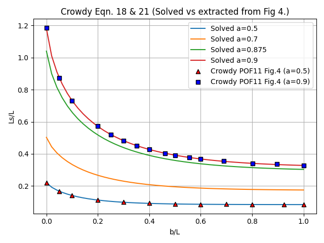

# Numerical approximation of slip length over longitudinal SH microgrooves with contact line recession 

This repository contains recipes for numerical solutions of the equations 18 and 21 of Crowdy's POF11 paper, "Frictional slip lengths and blockage coefficients, Crowdy D. POF 23, 091703 (2011)". These equations describe the slip length over a flat surface with SuperHydrophobic longitudinal microgrooves. Crowdy's equations,

$$a - \frac{1}{\Pi} \int_{-k}^{-1} \frac{\sqrt(\zeta - p)}{\sqrt(\zeta + k)\sqrt(1 - \zeta^{2})} d\zeta = 0 $$
$$b - \frac{1}{\Pi} \int_{-1}^{p} \frac{\sqrt(p - \zeta)}{\sqrt(\zeta + k)\sqrt(1 - \zeta^{2})} d\zeta = 0$$

describe the slip length for shear driven laminar flow over longitudinal superhydrophobic microgrooves with receding contact lines, for given $a$ and $b$ values where $1 \le k \le \infty$ and $-1 \le p \le 1$ are the unknowns (see figures 1 and 3 of Crowdy's paper) for a description of the parameters.

The script "solve.py" provides a solution for this system of equations for given values of $a$ and $b$. Figure below demonstrates the solution, superimposed with the solutions from figure 4 of Crowdy's paper for comparison and verification. 

  

The integrals are very stiff and required high precision arithmetic for evaluation, due to singularity at the boundaries. The resulting system of equation could be solved using the reqular Newton Raphson, however during the iterations the root falls into the complex plain, requiring careful treatment. Additionally, if you look carefully there is a small sign difference between these and Crowdy's equations. There seems to be a typo in his original paper. 
